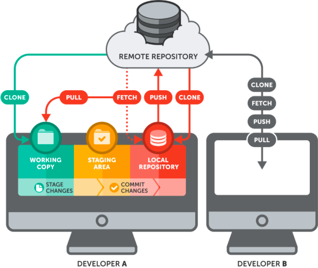

```{r setup, include=FALSE}
knitr::opts_chunk$set(echo = TRUE)
```

___
Le but de ce document est de te présenter les notions de base de Git et Gitlab. Ce document ce veut syntétique et pratique. Je donne des références si tu veux en apprendre plus. L'objectif est de te montrer l'intérêt de ces outils et comment on peut les mettres en pratique pour travailler efficasement en collaboratif.

___


<!-- **Pierre** : Bonjour, je te joins "script_final.R", la version final du code R du projet ;) -->

<!-- **Paul** : Merci ! -->

<!-- **2 semaines plus tard, Paul** : Salut, je comprends pas il y a des erreurs dans le code. Ca fait 2 jours que je me bas avec ! Help !!! -->

<!-- **Pierre** : Hello, désolé j'ai modifié le code depuis, j'ai oublié de te l'envoyer. Voici le nouveau "script_final_4.R".  -->


Toi aussi tu as connu ce genre de situation ? Tu ne veux plus que ça se reproduise ? Alors passe au outil collaboratif de versionnage Github ou Gitlab ! Ces outils permettent de travailler à plusieurs en évitant de s'échanger des fichiers par email et de se perdre dans les multiples versions des fichiers qui circules.

Et ça tombe bien car le Cirad héberge un serveur Gitlab à l'adresse : https://gitlab.cirad.fr/
Alors profitons en ! En plus ça fait une ligne de plus sur ton CV ;)


Tout d'abord, dans Github et Gitlab, il y a Git. Git est un logiciel open source de gestion de version en local. C'est à dire sur ton ordi, donc c'est pas collaboratif. Il permet de faire des sauvegardes régulières d'un projet et donc d'avoir un suivi et de pouvoir revenir en arrière si besoin.  Pour travailler à plusieurs ou même se faire des sauvegardes à l'exterieur de ton ordi (pratique s'il prend feu !), il faut combiner Git à Github ou Gitlab. 
Ce sont tout les deux des serveurs qui permet de stocker ton projet quelque part loin de ton ordi. 

* Github est hébergé par Microsoft. C'est gratuit (mais du coup c'est toi le produit !), après ils ont des offres payantes ...

* Gitlab est un logiciel open source que tu peux installer sur ton propre serveur (tu peux fabriquer ton Github à toi). Mais pas besoin d'en arriver là car le Cirad est à la pointe et propose son propre serveur Gitlab.

Et pour te faciliter la vie, Rstudio intègre nativament Git (et permet la connection à un serveur distant), donc pas besoin de taper des lignes de commande dans un terminale, donc pas d'excuse !


Pour plus de détail sur git, vous pouvez consulter ces articles : 

* https://www.jesuisundev.com/comprendre-git-en-7-minutes/

* https://thinkr.fr/travailler-avec-git-via-rstudio-et-versionner-son-code/#Git_et_RStudio


# Installation et configuration de git et Gitlab

Il faut commencer par installer Git sur ton ordi.

## Installation de Git

* Pour windows : http://git-scm.com/download/win

* Pour OSX : http://git-scm.com/download/mac

Lancer ensuite l'installateur.

* Pour linux : https://git-scm.com/book/fr/v2/D%C3%A9marrage-rapide-Installation-de-Git


## Configurations de Git
Il faut maintenant configurer Git, notamment ton identité pour savoir qui a fait des modif quand on collabore. Pour cela, il faut ouvrir un terminal. Sous OSX et Linux, pas de problème, le terminal existe. Pour Windows, il faut ouvrir l'application Git Bash qui vient d'être installer avec Git.
Sinon tu peux aussi en ouvrir un dans Rstudio : Tools > Terminal > New Terminal.

Pour configurer ton nom, il faut rentrer la commande :
```
git config --global user.name "Toto"
```
Et pour ton adresse email :
```
git config --global user.email "toto@cirad.fr"
```

## Configuration de la connection entre ton ordi et le serveur Gitlab du Cirad (ou Github)

Pour communiquer sur un projet entre ton ordi perso et ton compte Gitlab, il y a deux solutions, soit tu utilises un url https, soit une url SSH. C'est Gitlab qui te les génère (bouton "Clone" en bleu sur la page d'accueil du projet (un fois créé)).


Le mieux c'est d'utiliser une connection SSH, c'est plus sécurisant mais il faut générer une clé SSH sur ton ordinateur et la communiquer à compte Gitlab. 

### Paramétrage clé SSH : 
La encore, Rstudio est là pour t'aider. Cet étape est à faire une seul fois pour permettre la conncetion entre ton ordi et ton compte Gitlab. Pas besoin de la refaire pour chaque projet.


* Dans Rstudio, va dans "Tools > Global options > Git/SVN > Create RSA Key". Tu peux lui donner un mot de passe mais t'es pas obligé. Cette clé sera enregistré sur ton ordi à l'adresse qui est proposée. Une fois créer, clique sur "View public key" et copie le contenue. 
* Ensuite disrection Gitlab. Direction "Profile (en haut à droite, le rond avec un bonhomme) > Edit profile > onglet SSH Keys". Dans la section "Add an SSH key", colle la clé. Opperation à répéter si tu as plusieurs ordinateurs.


# Initialisation d'un projet 

## Clonage d'un projet depuis Gitlab vers ton ordi 

**Depuis Rstudio :** "File > New project > Version Control > GIT". Il faut ensuite recopier l'url (SSH ou HTTPS) du projet depuis la page d'accueil du projet sur Gitlab et choisir le chemin sur son ordi.

**Depuis un terminal** (Git Bash sous Windows)
```
git clone username@host:/path/to/repository
```

## Création d'un nouveau projet collaboratif

Le plus simple est de créer un nouveau projet sur Gitlab puis de le cloner sur son ordi en suivant les étapes décrite juste au dessus. 

Pour créer un nouveau projet sur le serveur Gitlab.Cirad, il faut ce raprocher d'un administrateur à l'adresse suivante : ....


## Connecter un projet local existant à Gitlab

Cette opération va nécessiter plusieurs étapes :

1. Il faut d'abord initialiser git sur ton projet local 
    + Il faut créer un Rproject, même si tu n'as pas de code R dans ton projet c'est pas génant. 
      Pour créer un Rproject dans un dossier de projet existant : File > New project... > Existing Directory. Tu peux alors choisir le dossier de ton projet existant. 

      Tu constateras que Rstudio a créé un nouveau fichier "nom_de_mon_dossier.Rproj". Ainsi, la prochaine fois que tu veux enregistrer une version de ton projet avec Rstudio, tu pourras double cliquer sur ce fichier Rproj.

    + Ensuite, il faut connecter ton Rproj à Git. Pour cela il faut aller dans "Tools > Version Control > Project setup... " dans l'onglet "Git/SVN", changer l'option "Version control system" de "(None)" en "Git". Confirmer et redémarer Rstudio.

2. Il faut créer un projet (du même nom) sur Gitlab. Se raprocher d'un administrateur si tu n'as pas les droits à l'adresse : ...

3. Il faut ensuite faire communiquer ton projet distant et projet local ensemble ...

**Depuis un terminal** (Git Bash sous Windows)
```
git remote add origin <server>
```

4. Maintenant que la connection est établie, il faut envoyer le contenu de ton projet local sur ton Gitlab ....


# Utilisation de Git et communication avec Gitlab depuis Rstudio




(source de l'image : https://www.git-tower.com/learn/media/pages/git/ebook/en/command-line/remote-repositories/introduction/3249033364-1649235984/basic-remote-workflow.png)

Je présente ici les oppérations de bases pour commencer à travailler avec ces outils.

Il faut distinguer les oppérations qui se font en local et et celle qui vont communiquer avec le serveur distant Gitlab. En local, le fichier de ton projet est ce qu'on appelle une copie de travail ("working copy" en vert sur le dessin). Il y a aussi ton répertoir local Git ("local repository" en rouge sur le dessin) qui va contenir toutes des sauvegardes locales. Tu n'es pas obligé de sauvegarder tous les fichier de ton projet, tu vas donc pouvoir les sélectionner, ils seront alors stockés dans la zone de transit ("staging area" en jaune sur le dessin).


**En local**, tu vas pouvoir sauvegarder 
Les oppérations les plus utilisées sont :

* "**status**" pour voir les fichiers qui ont été modifié depuis la dernière sauvegarde (commit)

* "**add**" pour sélectionner les fichiers avec lesquels tu veux faire une sauvegarde (mise en zone de transit)

* "**commit**" pour envoyer les fichiers en zone de transit dans une sauvegarde dans le répertoire local 

* Il est également possible de créer des branches pour travailler en parallele 

* Tu peux revenir sur une sauvegarde ultérieure

* Tu peux récupérer un fichier spécifique dans une précédente sauvegarde


**Oppération de base pour communiquer avec Gitlab**

* "**push**" pour envoyer ton projet de ton répertoire local (en rouge sur le dessin) vers Gitlab et ainsi pouvoir mettre à jour le projet sur Gitlab pour tout le monde.

* "**fetch**" pour importer la dernière version du projet depuis Gitlab vers ton répertoire local (en rouge sur le dessin). Il faut ensuite mettre à jour ta copie de travail (en vert sur le dessin) avec la fonction "**merge**".

* "**merge**" pour mettre à jour ta copie de travail après avoir fait un "**fetch**". Il risque d'y avoir des conflits à résoudre.

* "**pull**" qui combine les oppérations "**fetch**" et "**merge**"


**Opérations générales**

* "**log**" pour voir l'arboréscence des sauvegardes.


Dans Rstudio, on va pouvoir faire toutes ces oppérations depuis l'onglet "Git" dans la fenettre en haut à droite (l'onglet n'apparet que si tu as bien configurer les chose). De là, tu vas pouvoir tout gérer, plus besoin de paser par un terminal, c'est génial non ? 


