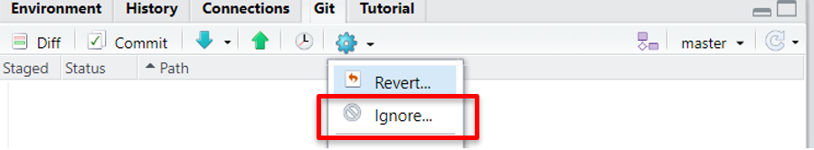
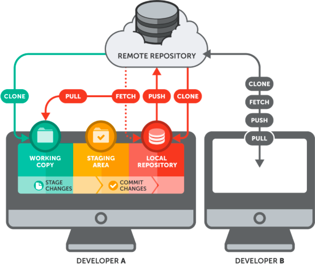
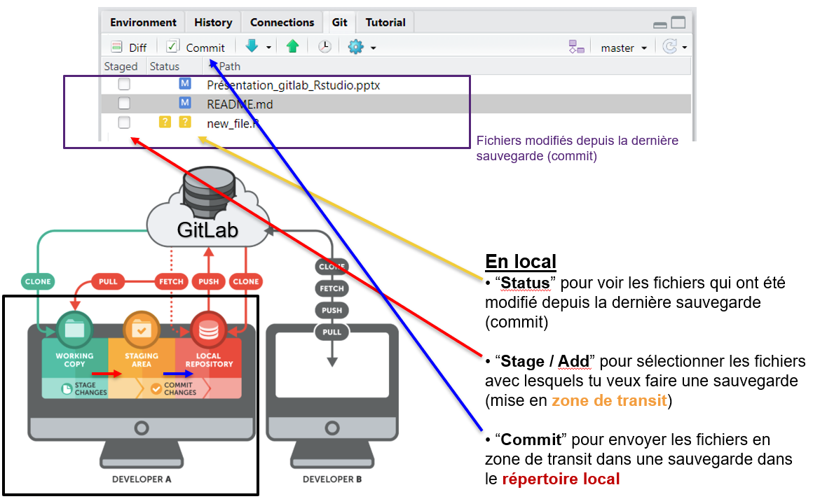
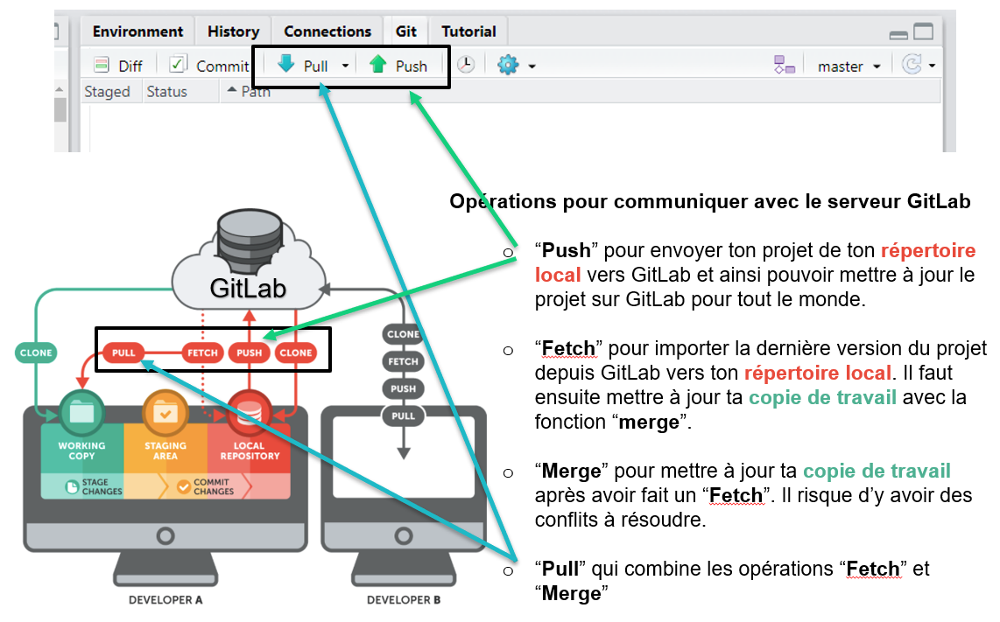
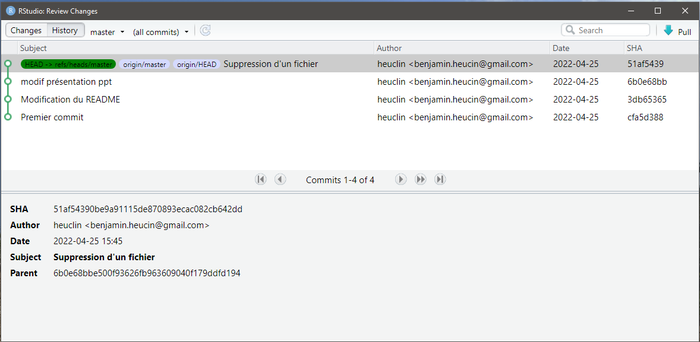

# GitLab !!! c'est quoi ce truc
Heuclin Benjamin, Cirad, UPR AÏDA
___
Le but de ce document est de te présenter les notions de base de Git et GitLab. Ce document se veut synthétique et pratique. Je donne des références si tu veux en apprendre plus. L'objectif est de te montrer l'intérêt de ces outils et comment on peut les mettre en pratique pour travailler efficacement en collaboratif.

___


<!-- **Pierre** : Bonjour, je te joins "script_final.R", la version final du code R du projet ;) -->

<!-- **Paul** : Merci ! -->

<!-- **2 semaines plus tard, Paul** : Salut, je comprends pas il y a des erreurs dans le code. Ca fait 2 jours que je me bas avec ! Help !!! -->

<!-- **Pierre** : Hello, désolé j'ai modifié le code depuis, j'ai oublié de te l'envoyer. Voici le nouveau "script_final_4.R".  -->


Toi aussi tu as connu ce genre de situation ? Tu ne veux plus que ça se reproduise ? Alors passe aux outils collaboratifs de versionnage Github ou GitLab ! Ces outils permettent de travailler à plusieurs en évitant de s'échanger des fichiers par email et de se perdre dans les multiples versions des fichiers qui circules.

Et ça tombe bien car le Cirad héberge un serveur GitLab à l'adresse : https://gitlab.cirad.fr/
Alors profitons-en ! En plus ça fait une ligne de plus sur ton CV ;)


Tout d'abord, dans Github et GitLab, il y a Git. Git est un logiciel open source de gestion de version en local. C'est-à-dire sur ton ordi, donc c'est pas collaboratif. Il permet de faire des sauvegardes régulières d'un projet et donc d'avoir un suivi et de pouvoir revenir en arrière si besoin.  Pour travailler à plusieurs ou même se faire des sauvegardes à l'extérieur de ton ordi (pratique s'il prend feu !), il faut combiner Git à Github ou GitLab. 
Ce sont tous les deux des serveurs qui permettent de stocker ton projet quelque part loin de ton ordi. 

* Github est hébergé par Microsoft. C'est gratuit (mais du coup c'est toi le produit !), après ils ont des offres payantes ...

* GitLab est un logiciel open source que tu peux installer sur ton propre serveur (tu peux fabriquer ton Github à toi). Mais pas besoin d'en arriver là car le Cirad est à la pointe et propose son propre serveur GitLab.

Et pour te faciliter la vie, Rstudio intègre nativement Git (et permet la connexion à un serveur distant), donc pas besoin de taper des lignes de commande dans un terminale, donc pas d'excuse !


Pour plus de détail sur git, vous pouvez consulter ces articles : 

* https://www.jesuisundev.com/comprendre-git-en-7-minutes/

* https://thinkr.fr/travailler-avec-git-via-rstudio-et-versionner-son-code/#Git_et_RStudio


# Installation et configuration de git et GitLab

Il faut commencer par installer Git sur ton ordi.

## Installation de Git

* Pour windows : http://git-scm.com/download/win

* Pour OSX : http://git-scm.com/download/mac

Lance ensuite l'installateur.

* Pour linux : https://git-scm.com/book/fr/v2/D%C3%A9marrage-rapide-Installation-de-Git


Plus d'info dans la documentation Cirad : https://gitlab.cirad.fr/cirad/documentation/-/wikis/Installation%20de%20Git%20sur%20Windows


## Configurations de Git
Il faut maintenant configurer Git, notamment ton identité pour savoir qui a fait des modif quand on collabore. Pour cela, il faut ouvrir un terminal. Sous OSX et Linux, pas de problème, le terminal existe. Pour Windows, il faut ouvrir l'application Git Bash qui vient d'être installée avec Git.
Sinon tu peux aussi en ouvrir un dans Rstudio : Tools > Terminal > New Terminal.

Pour configurer ton nom, il faut rentrer la commande :
```
git config --global user.name "Prénom Nom"
```
Et pour ton adresse email :
```
git config --global user.email "email@cirad.fr"
```

## Configuration de la connexion entre ton ordi et le serveur GitLab du Cirad (ou Github)

Pour communiquer sur un projet entre ton ordi perso et ton compte GitLab, il y a deux solutions, soit tu utilises un url https, soit une url SSH. C'est GitLab qui te les génères (bouton "Clone" en bleu sur la page d'accueil du projet (un fois créé)).


Le mieux c'est d'utiliser une connexion SSH, c'est plus sécurisant mais il faut générer une clé SSH sur ton ordinateur et la communiquer à compte GitLab. 

### Paramétrage clé SSH : 
La encore, Rstudio est là pour t'aider. Cette étape est à faire une seule fois pour permettre la connexion entre ton ordi et ton compte GitLab. Pas besoin de la refaire pour chaque projet.


* Dans Rstudio, va dans "Tools > Global options > Git/SVN > Create RSA Key". Tu peux lui donner un mot de passe mais t'es pas obligé. Cette clé sera enregistrée sur ton ordi à l'adresse qui est proposée. Une fois créer, clique sur "View public key" et copie le contenu. 

* Ensuite dans GitLab. Direction "Profile (en haut à droite, le rond avec un bonhomme) > Edit profile > onglet SSH Keys". Dans la section "Add an SSH key", colle la clé. Opération à répéter si tu as plusieurs ordinateurs.


# Initialisation d'un projet 

Vidéo -> https://youtu.be/Ly30zu8epwI


## Clonage d'un projet depuis GitLab vers ton ordi 

**Depuis Rstudio :** "File > New project > Version Control > GIT". Il faut ensuite recopier l'url (SSH ou HTTPS) du projet depuis la page d'accueil du projet sur GitLab et choisir le chemin sur son ordi.


## Création d'un nouveau projet collaboratif

Il faut créer un nouveau projet sur GitLab puis de le cloner sur son ordi en suivant les étapes décrites juste au-dessus. 

Pour créer un nouveau projet sur le serveur GitLab.Cirad, il faut se rapprocher d'un administrateur.


## Connecter un projet local existant à GitLab


Cette opération va nécessiter plusieurs étapes :

1. Il faut que le projet soit sous la forme d'un Rproject (même s'il n'y a pas de code R)
    + Si c'est pas le cas, dans Rstudio : File > New project... > Existing Directory. Tu peux alors choisir le dossier de ton projet existant. 

      Tu constateras que Rstudio a créé un nouveau fichier "nom_de_mon_dossier.Rproj". Ainsi, la prochaine fois que tu veux enregistrer une version de ton projet avec Rstudio, tu pourras double-cliquer sur ce fichier Rproj.


2. Il faut créer un projet sur GitLab. Se rapprocher d'un administrateur si tu n'as pas les droits. Copie l'adresse SSH ou FTTPS du projet GitLab.

3. Il faut ensuite faire communiquer ton projet local et ton projet GitLAb ensemble et envoyer le contenu local sur GitLab. Pour cela, il faut ouvrir un terminal, avec Rstudio -> "Tools > Terminal > New Terminal". Il faut ensuite rentrer les lignes de codes suivantes (une à une) en remplaçant l'adresse SSH par celle du projet GitLab :


```
git init --initial-branch=master 
git remote add origin ssh://git@gitlab.cirad.fr:2022/benjamin.heuclin/mon_projet.git 
git add . 
git commit -m "Initial commit" 
git push -u origin master 
```

4. Il faut ensuite redémarrer Rstudio. L'onglet Git apparaît alors en haut à droite.


# Deux fichiers importants

## Le ".gitignore"

Permet de définir des fichiers à ignorer dans les sauvegardes. Il peut être édité avec Rstudio 



On peut, par exemple : 

* ignorer des fichiers finiçants par l'extension ".Rhistory"
```
*.Rhistory
```

* ignorer le dosier "Data"

```
Data*
```

* excepter le fichier "données.xlsx" du dossier "Data" avec "!"

```
!Data/données.xlsx
```


## Le "README.md"

* Ce fichier, indispensable, permet de décrire / présenter le projet
* Il est affiché sur la page d’accueil du projet sur GitLab
* Très important lorsque tu partages ton projet avec le monde entier
* C’est du Markdown, tu peux l’éditer avec Rstudio : 
      -> File > New File > Markdown File
      
Plus d'info :

* https://en.wikipedia.org/wiki/README

* https://www.makeareadme.com/

* Guide de référence Markdown : https://commonmark.org/help/


# Utilisation de Git et communication avec GitLab depuis Rstudio

Je présente ici les opérations de bases pour commencer à travailler avec ces outils.




(source de l'image : https://www.git-tower.com/learn/media/pages/git/ebook/en/command-line/remote-repositories/introduction/3249033364-1649235984/basic-remote-workflow.png)


Il faut distinguer les opérations qui se font en local et celles qui vont communiquer avec le serveur distant GitLab. En local, le fichier de ton projet est ce qu'on appelle une copie de travail ("working copy" en vert sur le dessin). Il y a aussi ton répertoire local Git ("local repository" en rouge sur le dessin) qui va contenir toutes des sauvegardes locales. Tu n'es pas obligé de sauvegarder tous les fichiers de ton projet, tu vas donc pouvoir les sélectionner, ils seront alors stockés dans la zone de transit ("staging area" en jaune sur le dessin).

On va pouvoir tout faire depuis l'onglet Git dans Rstudio (en haut à droite). Depuis ce panneau de contrôle, tu vas pouvoir tout gérer, plus besoin de passer par un terminal, c'est génial non ? 


**En local :**




**Opérations de base pour communiquer avec GitLab :**




**L'historique**

L'historique permet de voir l'arborescence des sauvegardes. C'est le bouton en forme d'horloge.




* Tu peux voir qui a fait des modifications
* Tu peux voir ce qui a été modifié
* Tu peux récupérer un fichier spécifique dans une précédente sauvegarde
* Il est également possible de créer des branches pour travailler en parallèle


# Resources 

Pour en apprendre plus :

* https://www.jesuisundev.com/comprendre-git-en-7-minutes/
* https://thinkr.fr/travailler-avec-git-via-rstudio-et-versionner-son-code/#Git_et_RStudio

Pour le README :

* https://en.wikipedia.org/wiki/README
* https://www.makeareadme.com/
* Guide de référence Markdown : https://commonmark.org/help/

Documentation Cirad : https://gitlab.cirad.fr/cirad/documentation   

Vidéo d’initialisation de projet : https://youtu.be/Ly30zu8epwI


